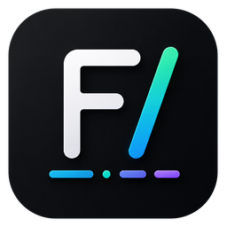

<p align="center">
  
</p>

<h1 align="center">Founcode</h1>

<p align="center"><b>Trust what your agents ship.</b><br/>
The Windows-first desktop orchestrator for AI coding agents —<br/>
every task is planned, executed in isolation, and independently verified before it touches your branch.</p>

<p align="center">
  <a href="https://github.com/LittleScript/founcode-releases/releases/latest"><b>⬇ Download for Windows</b></a>
</p>

---

## What is Founcode?

AI coding agents are powerful but unsupervised — they edit your working tree directly, and you find out what happened after the fact. Founcode turns them into a disciplined pipeline:

```
Idea ──▶ Blueprint ──▶ Plan ──▶ Execute ──▶ Verify ──▶ Merge
         (PRD + tasks)  (read-only,  (isolated git  (independent   (you approve)
                         you approve) worktree)      agent + tests)
```

- **Blueprint** — describe an idea in plain words; Founcode interviews you, drafts a structure map and a full PRD, then decomposes it into an ordered task graph. Works for brand-new apps *and* existing codebases (extend toward a goal, or reverse-engineer a PRD from the code).
- **Plan** — the agent analyzes your repo read-only and drafts a reviewable plan. Nothing is written until you approve.
- **Execute** — work happens in an isolated git worktree. Your branch is never touched mid-flight.
- **Verify** — a *separate* agent run checks the work against the plan and runs your build/tests before you see it.
- **Merge** — one click, only after verification passes and you've reviewed.

## Multi-agent, one pipeline

Bring the agent you already pay for — the pipeline is the same:

| Agent | Models |
|---|---|
| **Claude Code** | Opus / Sonnet / Haiku |
| **OpenCode** | 75+ providers: DeepSeek, GLM, Qwen, Kimi, Mistral, local Ollama… |
| **Codex** (OpenAI) | GPT-5 Codex family |
| **Antigravity** (Google) | Gemini 3 family |

Multi-agent support is **free** — pick per task, mix within one project.

## Free vs Pro

| | Free | Pro |
|---|---|---|
| Full Blueprint → Plan → Execute → Verify pipeline | ✅ | ✅ |
| All supported agents & models | ✅ | ✅ |
| Projects | 1 | Unlimited |
| Concurrent tasks | 1 | Parallel |
| Blueprint auto-advance | — | ✅ |

Pro licensing is launching shortly. Everything in the Free tier works offline and forever — your data stays in a local SQLite file, never on our servers.

## Install

1. Download `Founcode-Setup-x.y.z.exe` from the [latest release](https://github.com/LittleScript/founcode-releases/releases/latest).
2. Run it. Windows SmartScreen may warn (new unsigned publisher) — choose *More info → Run anyway*.
3. Have at least one agent CLI installed and logged in (e.g. [Claude Code](https://claude.com/claude-code) or [OpenCode](https://opencode.ai)).
4. Add a git project — or click **✦ Start from an idea** and build something new.

**Requirements:** Windows 10/11 x64 · git on PATH · at least one supported agent CLI.

## Feedback & issues

Found a bug or want a feature? [Open an issue](https://github.com/LittleScript/founcode-releases/issues) — we read everything.

---

<p align="center">© 2026 21Kent · Founcode is independent software, not affiliated with Anthropic, OpenAI, or Google.</p>
